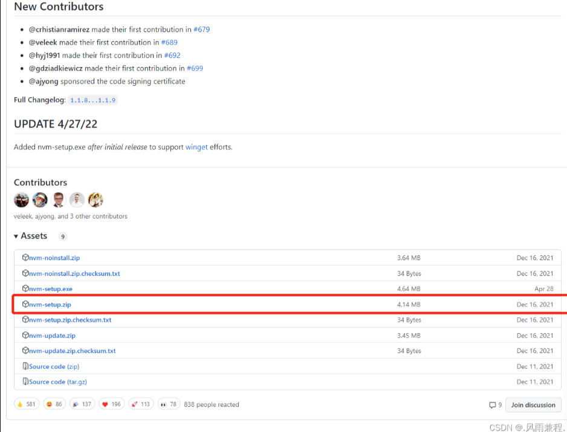
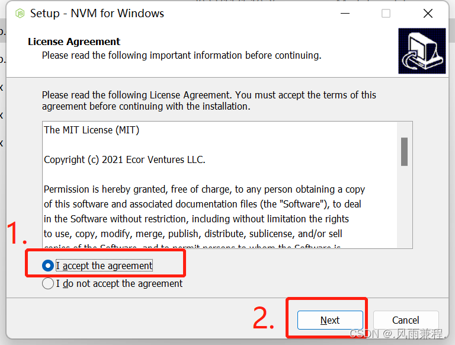
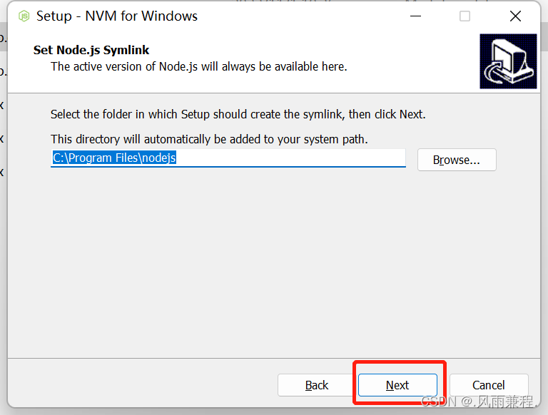
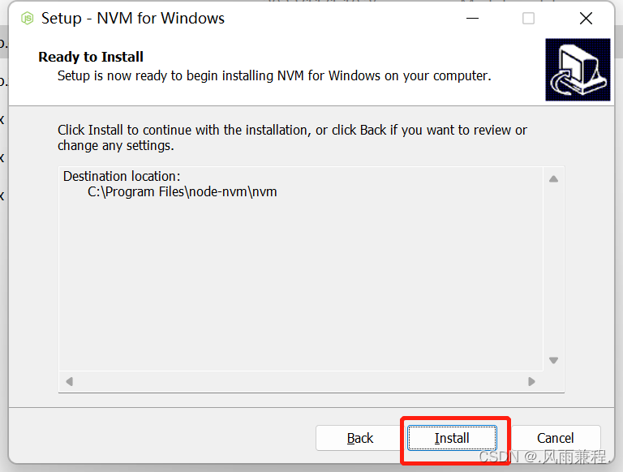
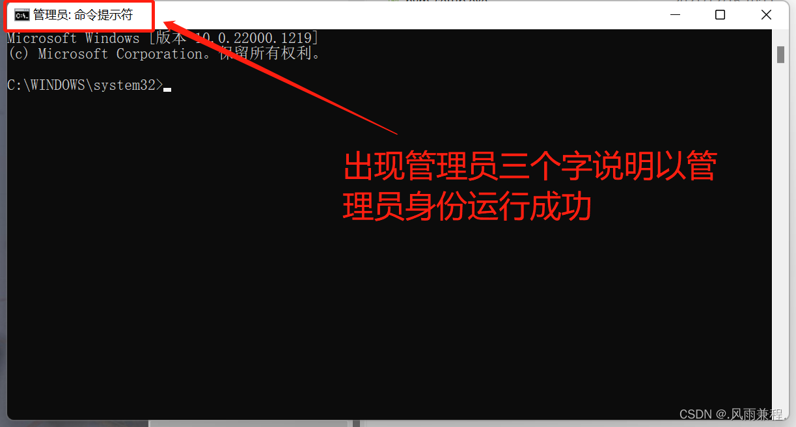
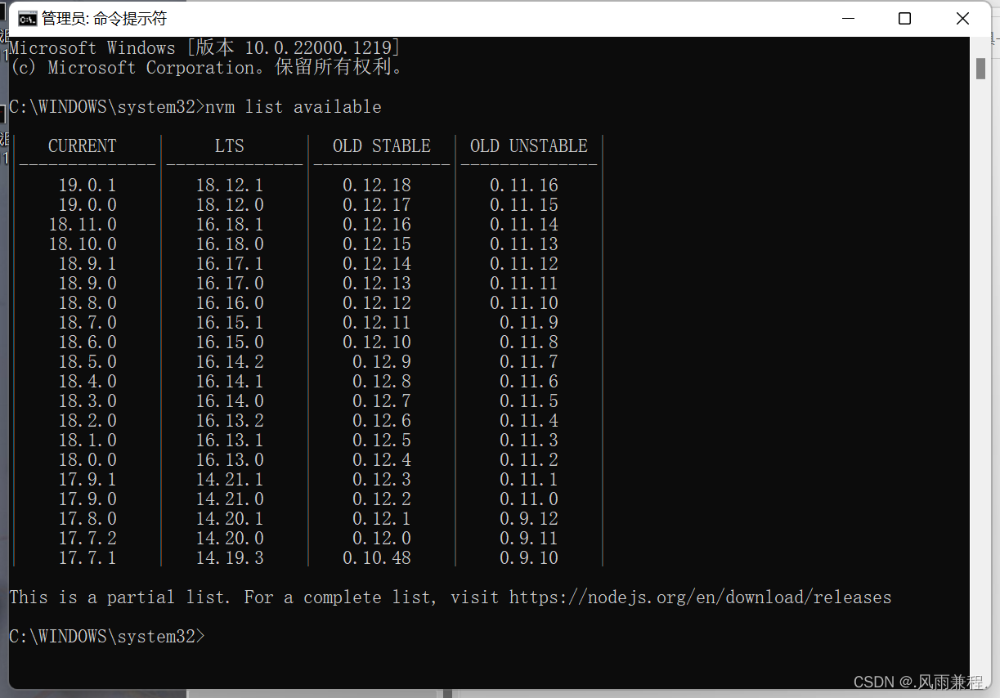
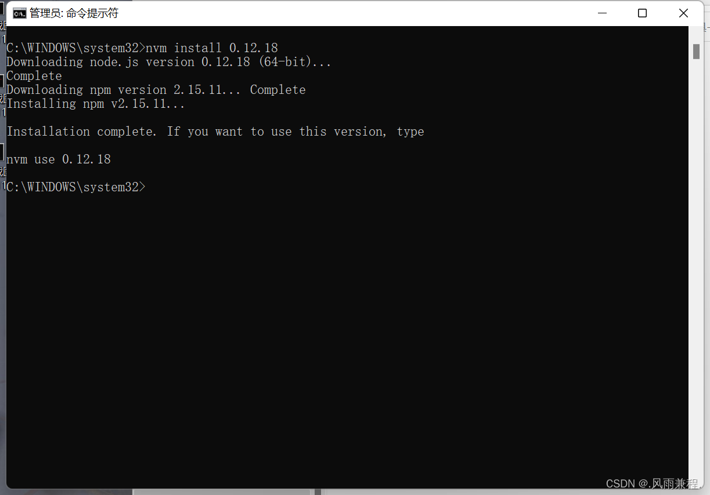
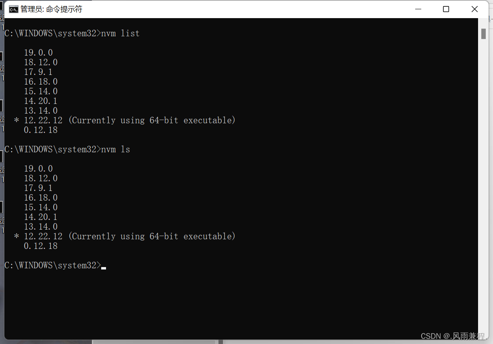
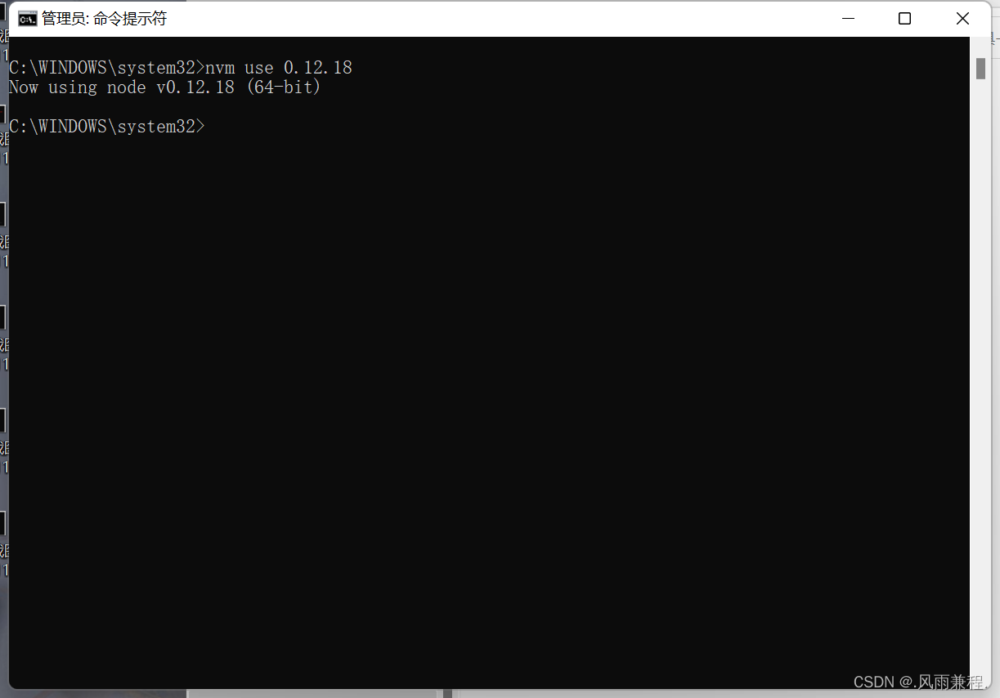

# 安装 nvm

## 1.下载 nvm

下载地址：https://github.com/coreybutler/nvm-windows/releases/tag/1.1.12

## 2.安装 nvm

1. 选择同意协议
   
2. nvm 安装路径
   
3. nodejs 存储路径，可能配置环境变量要使用（我还是默认路径）
   
4. 点击 install 等待安装完成
   

## 3.安装 node

**注：一定要使用管理员身份运行 cmd，一样是血的教训，懂得都懂哈**

1. 输入 nvm list available 查看可安装的 node 版本
   
2. 输入 nvm install 版本号 安装指定版本 node
   - 例：nvm install 0.12.18
     
3. 输入 nvm list 查看已安装版本的 node nvm ls 也可以
   
4. nvm use 已安装版本号 切换使用指定的版本的 node
   - 例：nvm use 0.12.18
     

## 4.相关命令

- nvm list 查看已经安装的版本
- nvm list installed 查看已经安装的版本
- nvm list available 查看网络可以安装的版本
- nvm version 查看当前的版本
- nvm install 安装最新版本
- nvm nvm use `<version>` ## 切换使用指定的版本
- node nvm ls 列出所有版本 nvm current 显示当前版本
- nvm alias `<name>` `<version>` ## 给不同的版本号添加别名
- nvm unalias `<name>` ## 删除已定义的别名
- nvm reinstall-packages `<version>` ## 在当前版本 node 环境下，重新全局安装指定版本号的 npm 包
- nvm on 打开 nodejs 控制
- nvm off 关闭 nodejs 控制
- nvm proxy 查看设置与代理
- nvm node_mirror `[url]` 设置或者查看 setting.txt 中的 node_mirror，如果不设置的默认是 Index of /dist/
- nvm npm_mirror `[url]` 设置或者查看 setting.txt 中的 npm_mirror,如果不设置的话默认的是： https://github.com/npm/npm/archive/
- nvm uninstall `<version>` 卸载制定的版本
- nvm use `[version]` `[arch]` 切换制定的 node 版本和位数
- nvm root `[path]` 设置和查看 root 路径
